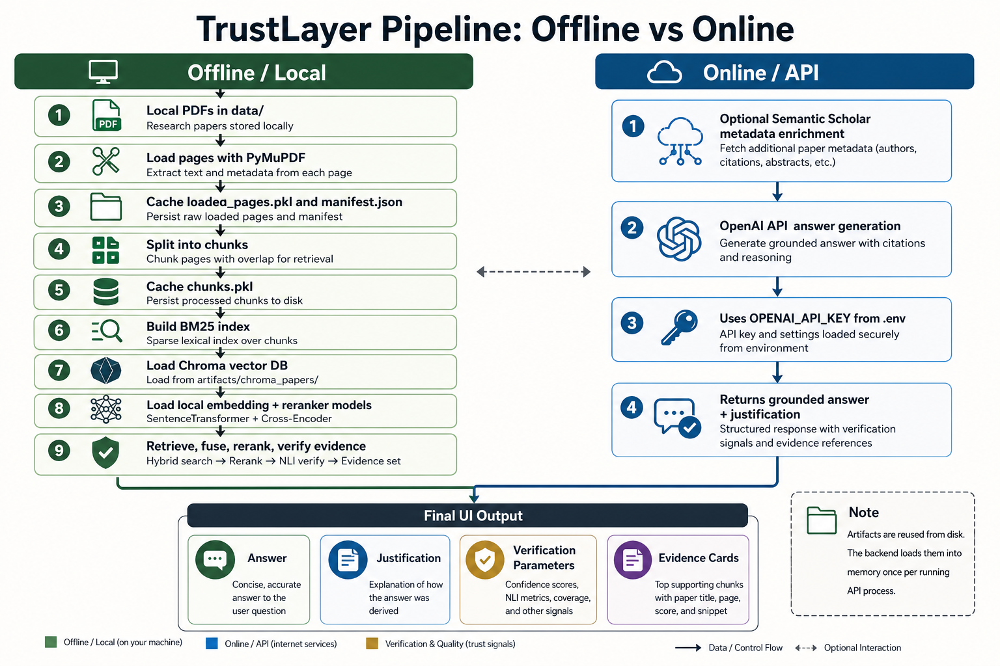

# TrustLayer

TrustLayer is a trust-aware research assistant for a local research-paper corpus. It combines local PDF ingestion, hybrid retrieval, cross-encoder reranking, corrective retrieval, grounded OpenAI answer generation, and verification-based abstention.

The goal is not only to answer a question, but to show why the answer should be trusted, what evidence was used, and when the system should say `Insufficient evidence`.



## Highlights

- Local PDF corpus support under `data/`
- Page-level PDF loading with metadata enrichment
- Research-paper chunking with reusable local artifacts
- Dense retrieval with Chroma, HNSW cosine, and Hugging Face embeddings
- Sparse retrieval with BM25
- Reciprocal rank fusion for dense + sparse candidates
- Cross-encoder reranking with `cross-encoder/ms-marco-MiniLM-L-6-v2`
- Corrective retrieval with query expansion and retries
- Grounded OpenAI answer generation
- Verification using retrieval confidence, evidence similarity, evidence coverage, NLI entailment, contradiction checks, and combined confidence
- Abstention when evidence is weak
- Streamlit UI
- React + TypeScript UI with a lightweight agentic retrieval router
- Local answer cache for repeated React queries
- Evaluation-question generation, retrieval metrics, verification metrics, and report-ready tables/figures

## How It Works

```text
Local PDFs
   |
   v
loader.py
   - load pages with PyMuPDF
   - enrich metadata
   - cache loaded pages and manifest
   |
   v
chunking.py
   - split pages into stable chunks
   - cache chunks
   |
   v
vector_db.py + main.py
   - build/load Chroma vector DB with cosine HNSW space
   - build BM25 index in memory
   - load cross-encoder reranker
   |
   v
corrective_Rag_pipeline.py
   - dense retrieval
   - BM25 retrieval
   - reciprocal rank fusion
   - cross-encoder reranking
   - corrective retry if needed
   |
   v
llm_generate.py
   - generate an answer using only retrieved evidence
   |
   v
verification
   - verify support
   - return answer or abstain
```

## Interfaces

TrustLayer has two UI options.

### Streamlit UI

The original app lives in [src/app.py](src/app.py). It uses the core pipeline directly.

```text
src/app.py
  -> src/main.py
  -> src/corrective_Rag_pipeline.py
```

### React UI

The React app lives in [frontend/](frontend/). It talks to a FastAPI bridge in [src/react_api.py](src/react_api.py).

```text
frontend React app
  -> FastAPI bridge: src/react_api.py
  -> agentic router: src/light_agentic_pipeline.py
  -> core RAG: src/corrective_Rag_pipeline.py
```

The React path adds a small agentic router. It does not use a heavy multi-agent framework. It only classifies the question shape and selects retrieval settings before calling the existing corrective RAG pipeline.

Example strategies:

- `balanced_hybrid`
- `definition_broad_context`
- `comparison_more_evidence`
- `citation_precision`
- `mechanism_explanation`

## Repository Structure

```text
TrustLayer/
├── assets/
│   └── trustlayer-pipeline-offline-online.png
├── frontend/
│   ├── src/
│   ├── package.json
│   └── vite.config.ts
├── src/
│   ├── app.py
│   ├── main.py
│   ├── react_api.py
│   ├── light_agentic_pipeline.py
│   ├── corrective_Rag_pipeline.py
│   ├── llm_generate.py
│   ├── loader.py
│   ├── chunking.py
│   ├── embeddings.py
│   ├── vector_db.py
│   └── knowledge_base_creation.py
├── .streamlit/
├── .github/workflows/
├── .env.example
├── requirements.txt
├── GITHUB_DEPLOYMENT.md
└── README.md
```

Local-only folders are ignored:

```text
data/
artifacts/
trustlayer_env/
.venv/
frontend/node_modules/
frontend/dist/
```

## Requirements

- Python 3.11 recommended
- Node.js 20+ or 22+
- An OpenAI API key
- A local PDF corpus under `data/`

The first run may download Hugging Face model weights for embeddings, reranking, and verification.

## Setup From Scratch

### 1. Clone the Repository

```bash
git clone <your-repo-url>
cd TrustLayer
```

### 2. Create a Python Virtual Environment

```bash
python3 -m venv trustlayer_env
source trustlayer_env/bin/activate
```

On Windows:

```bash
trustlayer_env\Scripts\activate
```

### 3. Install Python Dependencies

```bash
pip install -r requirements.txt
```

### 4. Configure Environment Variables

Copy the template:

```bash
cp .env.example .env
```

Fill in:

```bash
OPENAI_API_KEY=your_openai_api_key_here
TRUSTLAYER_APP_USERNAME=admin
TRUSTLAYER_APP_PASSWORD=change_me
```

Never commit `.env`.

### 5. Add a Paper Corpus

The app expects PDFs under `data/`, grouped by domain.

Example:

```text
data/
├── llm/
│   └── some_paper.pdf
├── nlp/
│   └── some_paper.pdf
├── rag/
│   └── some_paper.pdf
└── transformers/
    └── some_paper.pdf
```

You can also use the helper script to download a starter corpus from arXiv:

```bash
python src/knowledge_base_creation.py
```

That script is for offline corpus creation. The live RAG app uses [src/loader.py](src/loader.py) to read PDFs from `data/`.

## Run the Streamlit App

```bash
source trustlayer_env/bin/activate
streamlit run src/app.py
```

Then open the URL printed by Streamlit, usually:

```text
http://localhost:8501
```

## Run the React App

Use two terminals.

### Terminal 1: FastAPI Backend

```bash
cd TrustLayer
source trustlayer_env/bin/activate
uvicorn src.react_api:app --host 127.0.0.1 --port 8000
```

Do not use `--reload` when your virtual environment is inside the project folder. The reloader may watch `trustlayer_env/` and restart while models are loading.

### Terminal 2: React Frontend

```bash
cd TrustLayer/frontend
npm install
npm run dev
```

Open:

```text
http://localhost:5173
```

If the API is hosted somewhere else, create `frontend/.env.local`:

```bash
VITE_TRUSTLAYER_API_URL=http://127.0.0.1:8000
```

## First Run Expectations

The first real run can take time because TrustLayer may need to:

- read PDFs
- create `artifacts/loaded_pages.pkl`
- create `artifacts/manifest.json`
- create `artifacts/chunks.pkl`
- create/load `artifacts/chroma_papers/`
- build BM25 in memory
- load the embedding model
- load the cross-encoder reranker
- load verification models

Later questions are faster because artifacts are reused from disk and the running backend keeps models in memory.

The current runtime defaults use:

```text
chunk_size = 1200
chunk_overlap = 250
embedding_model = sentence-transformers/all-mpnet-base-v2
device = cpu
```

The final evaluation workflow additionally compares `BAAI/bge-base-en-v1.5`, which produced the strongest retrieval scores in the latest local experiment.

## Caching

TrustLayer uses local caches in `artifacts/`.

```text
artifacts/
├── loaded_pages.pkl
├── manifest.json
├── paper_metadata_cache.json
├── chunks.pkl
├── chunk_config.pkl
├── chroma_papers/
├── vectordb_config.json
└── react_answer_cache.json
```

Notes:

- Chunks and vector DB are reused across runs.
- BM25 is rebuilt in memory from cached chunks each backend start.
- The React API stores repeated question results in `artifacts/react_answer_cache.json`.
- If the corpus manifest changes, React answer cache keys change automatically.

## Evaluation and Report Artifacts

The evaluation workflow is local-only because generated questions, metrics, and report tables are written under `artifacts/`, which is intentionally not committed.

The latest report-ready metrics are committed under [docs/](docs/):

- [docs/final_report_summary.md](docs/final_report_summary.md)
- [docs/retrieval_performance_by_k.svg](docs/retrieval_performance_by_k.svg)
- [docs/embedding_ablation_k10.svg](docs/embedding_ablation_k10.svg)

Latest local evaluation setup:

```text
Corpus: 94 unique research papers / 95 PDFs
Evaluation set: 150 generated questions
Answerable questions: 132
Unanswerable questions: 18
Question quality: 0 vague/generic questions
Chunking: 1200 characters with 250 overlap
Final retrieval embedding: BAAI/bge-base-en-v1.5
Vector DB: Chroma with HNSW cosine
Hybrid retrieval: dense retrieval + BM25 + reciprocal rank fusion
Reranker: cross-encoder/ms-marco-MiniLM-L-6-v2
K values: 1, 3, 5, 10
```

Generate a cleaned evaluation question set:

```bash
trustlayer_env/bin/python src/generate_eval_questions.py \
  --target-questions 150 \
  --candidate-questions 600 \
  --target-papers 95 \
  --chunks-per-paper 12 \
  --output-csv artifacts/eval_questions_150_v5_chunks1200.csv
```

Run retrieval and answer-verification metrics:

```bash
HF_HUB_OFFLINE=1 TRANSFORMERS_OFFLINE=1 trustlayer_env/bin/python src/evaluate_retrieval_metrics.py \
  --questions-csv artifacts/eval_questions_150_v5_chunks1200.csv \
  --output-csv artifacts/report_metrics_150_v5_chunks1200_bge_k10_with_verification.csv \
  --ks 1 3 5 10 \
  --dense-k 50 \
  --sparse-k 50 \
  --fusion-k 100 \
  --final-k 10 \
  --chunk-size 1200 \
  --chunk-overlap 250 \
  --embedding-model BAAI/bge-base-en-v1.5 \
  --device cpu \
  --include-answer-metrics
```

Generate report-ready Markdown, CSV tables, and SVG figures:

```bash
trustlayer_env/bin/python src/generate_report_artifacts.py
```

The report files are written to:

```text
artifacts/report/
├── final_report_summary.md
├── experimental_setup.csv
├── question_distribution.csv
├── retrieval_performance_bge.csv
├── category_performance_bge_k10.csv
├── verification_metrics_bge.csv
├── embedding_ablation.csv
├── embedding_ablation_by_k.csv
├── retrieval_performance_by_k.svg
└── embedding_ablation_k10.svg
```

Because `artifacts/` is ignored, regenerate these locally whenever needed.

## Core Files

| File | Purpose |
| --- | --- |
| [src/app.py](src/app.py) | Streamlit UI |
| [src/react_api.py](src/react_api.py) | FastAPI bridge for React |
| [src/light_agentic_pipeline.py](src/light_agentic_pipeline.py) | Lightweight retrieval router for React |
| [src/main.py](src/main.py) | Builds documents, chunks, vector DB, BM25, reranker |
| [src/corrective_Rag_pipeline.py](src/corrective_Rag_pipeline.py) | Hybrid retrieval, correction, verification, abstention |
| [src/llm_generate.py](src/llm_generate.py) | OpenAI grounded answer generation |
| [src/loader.py](src/loader.py) | Runtime PDF loading and metadata enrichment |
| [src/knowledge_base_creation.py](src/knowledge_base_creation.py) | Optional arXiv corpus downloader |
| [src/chunking.py](src/chunking.py) | Chunk creation and chunk cache |
| [src/vector_db.py](src/vector_db.py) | Chroma vector DB management |
| [src/embeddings.py](src/embeddings.py) | Hugging Face embedding wrapper |
| [src/generate_eval_questions.py](src/generate_eval_questions.py) | Grounded evaluation-question generation |
| [src/evaluate_retrieval_metrics.py](src/evaluate_retrieval_metrics.py) | Retrieval and verification metric evaluation |
| [src/generate_report_artifacts.py](src/generate_report_artifacts.py) | Report-ready tables and SVG figures |

## Retrieval Details

### Dense Retrieval

Dense retrieval uses Hugging Face embeddings and Chroma. Chroma is configured with cosine HNSW metadata in [src/vector_db.py](src/vector_db.py). This finds semantically similar chunks even when words do not match exactly.

The app runtime default embedding model is:

```text
sentence-transformers/all-mpnet-base-v2
```

The evaluation scripts can test other embedding models with `--embedding-model`; the latest report workflow uses:

```text
BAAI/bge-base-en-v1.5
```

### BM25 Sparse Retrieval

BM25 is keyword-based. It finds chunks with strong lexical overlap with the query.

### Fusion

Dense and BM25 results are merged with reciprocal rank fusion. Chunks found by both methods get a stronger signal.

### Cross-Encoder Reranking

The reranker model is:

```text
cross-encoder/ms-marco-MiniLM-L-6-v2
```

It scores each `(query, chunk)` pair and reorders the fused candidates by relevance.

## Verification and Abstention

After generation, TrustLayer checks whether the answer is supported by retrieved evidence.

Signals include:

- retrieval confidence
- reranker confidence
- evidence coverage
- evidence similarity
- NLI entailment
- NLI contradiction
- combined confidence

If support is weak, the system returns:

```text
Insufficient evidence
```

This is expected behavior, not necessarily an error.

## React Agentic Router

The React pipeline includes a lightweight routing step in [src/light_agentic_pipeline.py](src/light_agentic_pipeline.py).

It chooses retrieval settings such as:

```text
Dense K
BM25 K
Fusion K
Final K
Retries
```

Example:

```text
Mechanism question:
Dense K: 24
BM25 K: 22
Fusion K: 60
Final K: 6
Retries: 2
```

The router is intentionally small. It does not replace the core RAG pipeline.

## Common Commands

Compile-check Python:

```bash
python3 -m py_compile src/*.py
```

Build React:

```bash
cd frontend
npm run build
```

Run React backend:

```bash
source trustlayer_env/bin/activate
uvicorn src.react_api:app --host 127.0.0.1 --port 8000
```

Run React frontend:

```bash
cd frontend
npm run dev
```

Run Streamlit:

```bash
source trustlayer_env/bin/activate
streamlit run src/app.py
```

Regenerate report artifacts:

```bash
source trustlayer_env/bin/activate
trustlayer_env/bin/python src/generate_report_artifacts.py
```

## Software Submission Package

Suggested zip for course software submission:

```bash
zip -r TrustLayer_software.zip \
   src frontend assets .streamlit .github \
   README.md GITHUB_DEPLOYMENT.md requirements.txt .env.example \
   -x "trustlayer_env/*" \
       ".venv/*" \
       "frontend/node_modules/*" \
       "frontend/dist/*" \
       "data/*" \
       "artifacts/*" \
       "*.log"
```

This keeps the package reproducible while excluding local environments, raw corpus files, and large generated artifacts.

## Troubleshooting

### The App Says `Insufficient evidence`

Possible reasons:

- the corpus does not contain enough evidence
- retrieval confidence is low
- verification thresholds rejected the answer
- evidence was related but not directly supportive

Check the Evidence, Verification, and Context tabs in the UI.

### First Question Is Slow

This is normal. The backend may be loading models and artifacts into memory. Keep the backend running after the first question.

### Uvicorn Reload Keeps Restarting

Run without `--reload`:

```bash
uvicorn src.react_api:app --host 127.0.0.1 --port 8000
```

### Hugging Face Model Warnings

Some model loading warnings are harmless, especially when loading sentence-transformer or transformer checkpoints with extra keys. If the model finishes loading, the app can continue.

### Missing or Weak Paper Titles

Runtime metadata comes from PDF heuristics, optional Semantic Scholar enrichment, and filename fallbacks. The React API also applies display-only cleanup for generic titles like `Preprint` or date strings.

## GitHub Notes

See [GITHUB_DEPLOYMENT.md](GITHUB_DEPLOYMENT.md) for a publishing checklist.

Current repository URL:

```text
https://github.com/DoSomethingGreat07/TrustLayer
```

Do not commit:

- `.env`
- `data/`
- `artifacts/`
- virtual environments
- `frontend/node_modules/`
- `frontend/dist/`

Safe to commit:

- `src/`
- `frontend/`
- `assets/`
- `.streamlit/config.toml`
- `.github/workflows/ci.yml`
- `requirements.txt`
- `.env.example`
- `README.md`
- `GITHUB_DEPLOYMENT.md`

## CI

The GitHub Actions workflow in [.github/workflows/ci.yml](.github/workflows/ci.yml) checks:

- Python compile validity
- frontend dependency install
- React production build

## License

Add your preferred license before publishing publicly.
